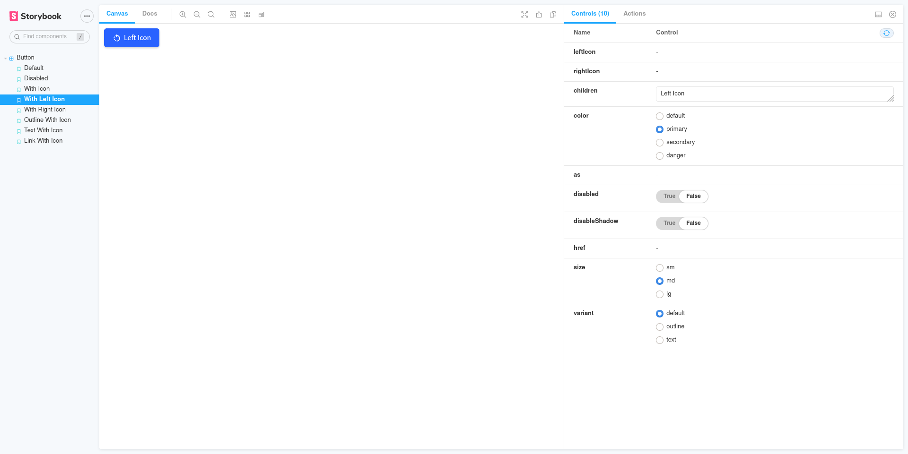

# DevChallenges - Design System

Solution for a challenge from [Devchallenges.io](http://devchallenges.io).

### [Demo](https://felipeuliana.github.io/devchallenges-design-system/) | [Solution](https://github.com/felipeuliana/devchallenges-design-system) | [Challenge](https://devchallenges.io/challenges/ohgVTyJCbm5OZyTB2gNY)

## Table of Contents

- [Overview](#overview)
  - [Built With](#built-with)
- [Features](#features)
- [Contact](#contact)
- [Acknowledgements](#acknowledgements)

## Overview

Here you can see the [demo](https://felipeuliana.github.io/devchallenges-design-system/) that I developed for the _DevChallenges Button component_.

It was a great experience from _DevChallenges_, where I can pratice some techniques and exploring new technologies.

### Built With

This project was bootstrapped with:

- [Create React App](https://github.com/facebook/create-react-app);
- Complemented with [TypeScript](https://www.typescriptlang.org/docs/handbook/typescript-in-5-minutes.html);
- Styled with [Styled Components](https://styled-components.com/docs/basics) and its [ecosystem](https://styled-components.com/ecosystem);
- Tested with [Jest](https://jestjs.io/docs/en/getting-started.html) and [React Testing Libray](https://jestjs.io/docs/en/getting-started.html);
- And displayed with [Storybook](https://storybook.js.org/docs/react/get-started/introduction).

#### Available Scripts

In the project directory, you can run:

##### `yarn generate`

Run the script to generate a component with the files below:
- index.tsx;
- stories.tsx;
- styles.ts;
- test.tsx.

##### `yarn storybook`

Run an instance of Storybook to visualize the components stories.
Open [http://localhost:6006](http://localhost:6006) to view it in the browser.

##### `yarn build-storybook`

Builds your stories for production.\
Your stories is ready to be deployed!

##### `yarn test`

Launches the test runner.

##### `yarn test:watch`

Launches the test runner in the interactive watch mode.\
See the section about [running tests](https://facebook.github.io/create-react-app/docs/running-tests) for more information.

##### `yarn start`

Runs the app in the development mode.\
Open [http://localhost:3000](http://localhost:3000) to view it in the browser.

The page will reload if you make edits.\
You will also see any lint errors in the console.

##### `yarn build`

Builds the app for production to the `build` folder.\
It correctly bundles React in production mode and optimizes the build for the best performance.

The build is minified and the filenames include the hashes.\
Your app is ready to be deployed!

See the section about [deployment](https://facebook.github.io/create-react-app/docs/deployment) for more information.

##### `yarn eject`

**Note: this is a one-way operation. Once you `eject`, you can’t go back!**

If you aren’t satisfied with the build tool and configuration choices, you can `eject` at any time. This command will remove the single build dependency from your project.

Instead, it will copy all the configuration files and the transitive dependencies (webpack, Babel, ESLint, etc) right into your project so you have full control over them. All of the commands except `eject` will still work, but they will point to the copied scripts so you can tweak them. At this point you’re on your own.

You don’t have to ever use `eject`. The curated feature set is suitable for small and middle deployments, and you shouldn’t feel obligated to use this feature. However we understand that this tool wouldn’t be useful if you couldn’t customize it when you are ready for it.

## Features

This application/site was created as a submission to a [DevChallenges](https://devchallenges.io/challenges) challenge. The [challenge](https://devchallenges.io/challenges/ohgVTyJCbm5OZyTB2gNY) was to build an application to complete the given user stories:

- __User story__: I can see different button types: default, outline and text;
- __User story__: I can choose to disable box-shadow;
- __User story__: I can choose to disable button;
- __User story__: I can choose to have an icon on the left or right (Use Google Icon and at least 5 variants);
- __User story__:: I can have different button sizes;
- __User story__: I can have different colors;
- __User story__: When I hover or focus, I can see visual indicators;
- __User story__: I can still access all button attributes;
- __User story__ (optional): Show button in a similar way like the design or use Storybook. Otherwise, showing the button in multiple states is enough.

## Contact

- Linkedin [@felipeuliana](https://www.linkedin.com/in/felipe-uliana-461520107/)
- GitHub [@felipeuliana](https://github.com/felipeuliana)
